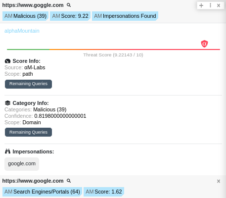

# Polarity alphaMountain Integration

The Polarity alphaMountain integration uses the API used in threatYeti to searches URLs for a Threat Score, Category and possible Impersonations.

alphaMountain is a cutting-edge data analysis platform that harnesses the power of advanced algorithms and machine learning techniques to provide comprehensive risk scores, content categories, and possible impersonations. For more information about alphaMountain, please visit the [official website](https://www.alphamountain.com).

|  |
| ------------------------------------- |
| _Example 1_                           |

## alphaMountain Integration Options

### alphaMountain API Key

Your alphaMountain API Key

## Installation Instructions

Installation instructions for integrations are provided on the [PolarityIO GitHub Page](https://polarityio.github.io/).

## Polarity

Polarity is a memory-augmentation platform that improves and accelerates analyst decision making. For more information about the Polarity platform, please see:

https://polarity.io/
